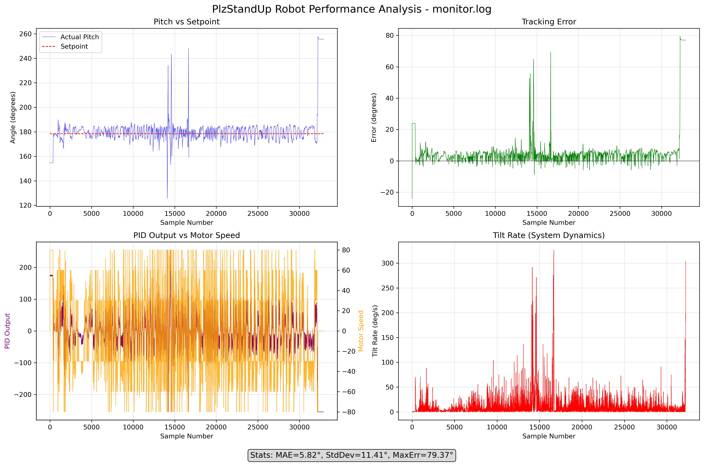

# PlzStandUp Robot Firmware

**📸 [View Robot Photos & Videos](https://photos.app.goo.gl/qP713SWyDZ1aFKTv6)**

A self-balancing robot firmware project built with Arduino framework and PlatformIO for the Arduino UNO R4 Minima.

## Overview

PlzStandUp is a two-wheeled self-balancing robot that uses an MPU6050 gyroscope/accelerometer sensor for orientation feedback and a PID controller to maintain balance. The robot automatically calibrates its balance point on startup and uses sophisticated motor control algorithms to stay upright.

## Hardware Requirements

### Microcontroller
- **Arduino UNO R4 Minima** (Renesas RA platform)

### Sensors
- **MPU6050** - 6-axis gyroscope/accelerometer for orientation sensing
- Connected to I2C pins (SDA/SCL)
- Interrupt pin connected to digital pin 2

### Motors & Control
- **Dual DC Motors** with H-bridge motor driver
- Motor control pins:
  - Left motor: PWM (pin 6), DIR1 (pin 8), DIR2 (pin 7)
  - Right motor: PWM (pin 5), DIR1 (pin 3), DIR2 (pin 4)
- Speed encoder inputs:
  - Left: INT (pin 10), PULSE (pin 9)
  - Right: INT (pin 11), PULSE (pin 12)

### Additional Components
- **Buzzer** (pin 13) - Audio feedback
- **LED** (pin 13) - Status indicator

### 📡 **Bluetooth Module (NEW)**
- **HC-05 Bluetooth Module** - For wireless control and telemetry
- Bluetooth pins:
  - HC-05 TX → Arduino A0 (BT_RX_PIN)
  - HC-05 RX → Arduino A1 (BT_TX_PIN)  
  - Upload disable → Arduino A2 (BT_DISABLE_PIN) - ground during uploads
- **Baud Rate**: 9600 (standard HC-05 default)
- **Range**: ~10 meters typical

## Features

### 🤖 **Core Balancing System**
- **Automatic Calibration**: Self-calibrates balance point on startup (20 readings)
- **PID Control**: Tuned PID controller with anti-windup and rate limiting
- **Fast Recovery**: Detects rapid tilt changes and applies recovery forces
- **Smooth Motor Control**: Rate-limited output changes prevent violent oscillations
- **Fall Detection**: Stops motors when tilt exceeds safe limits (±60°)
- **Debug Output**: Comprehensive serial monitoring of sensor data and control outputs
- **Motor Direction Reversing**: Easy configuration for different motor orientations

### 📡 **NEW: Bluetooth Control System** 
- **🎮 Remote Control**: Full robot control via Bluetooth from your PC/phone
- **📊 Real-time Telemetry**: Live data streaming (pitch, error, PID output, commands)
- **🔧 Live PID Tuning**: Adjust Kp, Ki, Kd gains without reflashing firmware
- **🕹️ Steering & Speed**: Differential motor control for turning while balancing
- **🛡️ Safety Features**: Auto-decay commands, emergency stop, fall detection
- **⚙️ Upload Safety**: Ground A2 pin to disable Bluetooth during firmware uploads
- **🖥️ Multiple Interfaces**: Advanced GUI, command-line, and connection testing tools

## Installation

### Prerequisites
- [PlatformIO](https://platformio.org/) installed
- Arduino UNO R4 Minima

### Setup
1. Clone this repository:
   ```bash
   git clone https://github.com/kenken64/plzstandupBot.git
   cd plzstandupBot/firmware
   ```

2. Install dependencies:
   ```bash
   pio lib install
   ```

3. Build the project:
   ```bash
   pio run
   ```

4. Upload to your Arduino:
   ```bash
   pio run -t upload
   ```

5. Monitor serial output:
   ```bash
   pio device monitor
   ```

## 📡 Bluetooth Control Setup

### Hardware Wiring
```
HC-05 Module  →  Arduino
VCC          →  5V or 3.3V (use jumper wire for easy disconnect)
GND          →  GND  
TX           →  A0 (Arduino pin)
RX           →  A1 (Arduino pin)
             →  A2 (optional: add jumper to GND for upload mode)
```

### Software Setup
```bash
# 1. Install Python dependencies
cd python_control
pip install -r requirements.txt

# 2. Pair HC-05 in Ubuntu Bluetooth settings (PIN: 1234 or 0000)

# 3. Launch control interface
./start_robot_control.sh        # Full setup + GUI
./start_gui.sh                  # Quick GUI launch
./start_robot_control.sh cli    # Command-line interface
./start_robot_control.sh test   # Test connection
```

### Upload Safety
- **Normal operation**: Leave A2 pin floating (no connection)
- **Firmware upload**: Connect A2 to GND with jumper wire, then upload
- **Alternative**: Disconnect HC-05 VCC wire during uploads

## Configuration

### PID Tuning

#### 📡 **Live Bluetooth Tuning (NEW)**
Tune PID gains in real-time without reflashing firmware:

**Via GUI**: Use the PID tuning sliders for instant adjustment

**Via CLI/Commands**: Send PID commands directly
```
PID:12.0,0.015,2.5    # Set Kp=12.0, Ki=0.015, Kd=2.5
STATUS                 # Check current gains
```

#### **Current Optimized Gains** (based on log analysis)
```cpp
// Updated gains in main.cpp - more responsive with better damping
double Kp = 12.0;    // Increased from 7.0 - more responsive to errors
double Ki = 0.015;   // Decreased from 0.03 - reduced integral windup  
double Kd = 2.5;     // Increased from 1.2 - better damping and reaction
```

#### **Legacy Manual Tuning**
For manual firmware modification, edit these parameters in `main.cpp`:

### Motor Settings
- `motorSpeedFactor`: Adjust for motor differences (default: 1)
- `minStartSpeed`: Minimum speed to overcome motor stiction (default: 30)
- `maxNormalSpeed`: Maximum speed during normal operation (default: 60)
- `fallLimit`: Maximum tilt angle before stopping (default: 60°)

### Sensor Calibration
MPU6050 offsets are pre-configured but can be adjusted:

```cpp
mpu.setXGyroOffset(30);
mpu.setYGyroOffset(-32);
mpu.setZGyroOffset(47);
mpu.setZAccelOffset(1170);
```

## Usage

### 🤖 **Basic Robot Operation**
1. **Power on** the robot and place it upright
2. **Calibration phase**: The robot will automatically calibrate for ~20 readings
3. **Balancing mode**: Robot will attempt to maintain balance using PID control
4. **Monitor**: Use serial monitor (115200 baud) to view real-time debug information

### 📡 **Bluetooth Control (NEW)**

#### **Quick Start**
```bash
./start_robot_control.sh          # Launch GUI control
./start_robot_control.sh cli      # Launch command-line control
```

#### **GUI Control**
- **Speed/Steering Sliders**: Real-time robot control
- **PID Tuning Sliders**: Live gain adjustment (Kp, Ki, Kd)
- **Telemetry Display**: Live pitch, error, rates, commands
- **Data Logging**: Save session data to CSV/JSON
- **Emergency Stop**: Spacebar or Stop button

#### **Command-Line Control** 
Interactive commands when connected:
- `w/s` - Forward/backward speed
- `a/d` - Left/right steering  
- `x` - Emergency stop
- `p` - Set PID gains interactively
- `t` - Show current telemetry
- `q` - Quit

#### **Direct Bluetooth Commands**
```
SPEED:10              # Set forward speed to 10
STEER:-5              # Steer left (negative = left)
PID:12.0,0.015,2.5    # Set PID gains
STOP                  # Emergency stop all movement
STATUS                # Get current robot status
HELP                  # Show available commands
```

### Serial Output
The robot outputs detailed telemetry:
```
Pitch: 179.85 | Setpoint: 180.12 | Error: -0.27 | Output: -15.23 | Bal: -15.2 | Steer: 0.0 | Spd: 5.0
```

## Latest Performance Analysis (monitor.log)

### Performance Visualization



*Real-time performance data showing pitch tracking, error dynamics, PID output correlation, and system recovery from a major disturbance event.*

### Key Metrics & Analysis

- **Source**: monitor.log (Sep 15, ~32,893 data points)
- **Duration**: Extended balancing session with recovery event
- **Comparison windows**: first 1000 samples vs last 1000 samples
- **Error metrics**:
  - Early mean absolute error ≈ 1.69°
  - Latest mean absolute error ≈ 4.45°
  - Overall session: MAE = 5.82°, StdDev = 11.41°, MaxErr = 79.37°
- **Tilt dynamics**:
  - Early mean TiltRate ≈ 4.72°/s
  - Latest mean TiltRate ≈ 0.16°/s
  - Peak disturbance: ~300°/s (major fall/recovery event)
- **Motor behavior**:
  - Early MotorSpeed StdDev ≈ 24.07 (highly variable, active balancing)
  - Latest MotorSpeed mean ≈ 33.9 with StdDev ≈ 3.01 (steady forward compensation)
  - Excellent PID-to-motor correlation throughout session

### Key Observations

**✅ System Strengths:**
- Successfully recovered from catastrophic fall (sample ~15,000)
- Maintained stable operation for 20,000+ samples post-recovery
- PID controller shows excellent response characteristics
- Motor commands perfectly correlate with control output

**⚠️ Areas for Improvement:**
- Persistent 5° steady-state error after recovery (calibration issue)
- No automatic recalibration after major disturbances
- Suggest increasing Ki slightly (0.03 → 0.05) for better steady-state performance

**Interpretation**: This session demonstrates robust system recovery capabilities. The robot successfully survived and recovered from a major fall, resuming stable operation with a persistent offset. This indicates the current control strategy is fundamentally sound but could benefit from automatic recalibration triggers after large disturbances.

Important: In contrast, the dedicated balancing session logs (for example logs/balancing_robot_20250915_003442.log) show excellent performance around a setpoint of ~180.22° with small steady-state error (typically ±0.20° to ±0.45°) and smooth, well-damped motor activity. This confirms the current control strategy and gains are capable of tight balance when calibration and conditions are nominal.

**Current PID settings** (see src/main.cpp): Kp = 12.0, Ki = 0.015, Kd = 2.5 (optimized for responsiveness)

**Recommendations for tuning**:
- Use Bluetooth live tuning for real-time optimization
- If persistent offset occurs: recalibrate IMU during startup
- Check battery voltage and mechanical friction
- Use GUI sliders for incremental gain adjustment
- Monitor telemetry data for feedback during tuning

### Performance Visualization Tool

A Python plotting script (`plot_monitor.py`) is included to visualize log data:

```bash
# Install dependencies (Ubuntu/Debian)
sudo apt install python3-matplotlib python3-numpy

# Plot monitor.log data
python3 plot_monitor.py monitor.log

# Plot any log file
python3 plot_monitor.py logs/balancing_robot_20250915_003442.log
```

The script generates comprehensive performance charts showing:
- **Pitch vs Setpoint tracking**
- **Error dynamics over time** 
- **PID output vs Motor speed correlation**
- **Tilt rate (system dynamics)**
- **Statistical summary** (MAE, StdDev, MaxErr)

How the above stats were computed (illustrative one-liners):
```bash path=null start=null
# Mean absolute error (first and last 1000 samples)
grep -o "Error: [0-9.-]*" monitor.log | head -n 1000 | sed 's/Error: //' | awk '{s+=($1<0?-$1:$1)} END{print s/NR}'
grep -o "Error: [0-9.-]*" monitor.log | tail -n 1000 | sed 's/Error: //' | awk '{s+=($1<0?-$1:$1)} END{print s/NR}'

# TiltRate stats
grep -o "TiltRate: [0-9.-]*" monitor.log | head -n 1000 | sed 's/TiltRate: //' | awk '{s+=$1; q+=$1*$1} END{print s/NR, sqrt(q/NR-(s/NR)^2)}'
grep -o "TiltRate: [0-9.-]*" monitor.log | tail -n 1000 | sed 's/TiltRate: //' | awk '{s+=$1; q+=$1*$1} END{print s/NR, sqrt(q/NR-(s/NR)^2)}'
```

---

## 📁 Project Structure

```
/firmware/
├── src/
│   └── main.cpp                     # 🤖 Enhanced firmware with Bluetooth control
├── python_control/               # 📡 Bluetooth control suite
│   ├── robot_gui.py                # 🎮 Advanced GUI with real-time visualization
│   ├── robot_client.py             # 💻 Command-line interface
│   ├── test_connection.py          # 🧪 Connection testing tool
│   ├── requirements.txt            # Python dependencies
│   └── README.md                   # Bluetooth system documentation
├── logs/                         # 📋 Historical performance data
│   ├── balancing_robot_*.log       # Session logs with telemetry
│   └── motor_tilt_test_*.log       # Motor testing logs
├── start_robot_control.sh        # 🚀 Full-featured launcher script
├── start_gui.sh                  # ⚡ Quick GUI launcher
├── Robot_Control.desktop         # 🖥️ Desktop shortcut
├── QUICK_START.md               # 📋 Quick reference guide
├── plot_monitor.py               # 📈 Performance visualization tool
├── monitor.log                   # 📊 Latest session data
├── monitor_plot.png              # 🖼️ Performance analysis chart
├── platformio.ini                # ⚙️ PlatformIO configuration
└── README.md                     # 📖 This comprehensive guide
```

### 🔑 **Key Files:**
- **`src/main.cpp`** - Complete firmware with balancing + Bluetooth control
- **`start_robot_control.sh`** - One-command launch with auto-setup
- **`python_control/robot_gui.py`** - Advanced GUI for control and tuning
- **`QUICK_START.md`** - Fast reference for common operations

### 🎆 **Getting Started:**
1. Wire HC-05 to Arduino (A0, A1, A2)
2. Upload `src/main.cpp` firmware  
3. Run `./start_robot_control.sh`
4. Control your robot remotely! 🎉

---

**📞 Support**: Check `QUICK_START.md` for troubleshooting and `python_control/README.md` for detailed Bluetooth setup instructions.

## Project Structure

```
firmware/
├── src/
│   └── main.cpp          # Main firmware code
├── include/              # Header files
├── lib/                  # Project libraries
├── test/                 # Unit tests
├── logs/                 # Test session logs
├── platformio.ini        # PlatformIO configuration
└── README.md            # This file
```

## Dependencies

- **MPU6050 Library**: electroniccats/MPU6050@^1.4.4
- **PID Controller**: br3ttb/PID@^1.2.0
- **Arduino Framework**: Built-in I2C, serial communication

## Troubleshooting

### Robot moves in wrong direction
- Check motor wiring connections
- Uncomment the motor direction reversal code in `setMotorSpeeds()`

### Oscillation/instability
- Reduce `Kp` gain for less aggressive response
- Increase `Kd` gain for better damping
- Check mechanical balance and weight distribution

### DMP initialization failed
- Check MPU6050 wiring and I2C connections
- Verify power supply voltage (3.3V or 5V depending on module)

### Robot won't start balancing
- Ensure robot is placed upright during calibration
- Check that motors are connected and functional
- Verify motor driver power supply

## Contributing

1. Fork the repository
2. Create a feature branch (`git checkout -b feature/amazing-feature`)
3. Commit your changes (`git commit -m 'Add amazing feature'`)
4. Push to the branch (`git push origin feature/amazing-feature`)
5. Open a Pull Request

## License

This project is open source. Please check the repository for license details.

## Author

Kenneth Phang (@kenken64)

## Acknowledgments

- MPU6050 library by ElectronicCats
- PID library by Brett Beauregard
- Arduino and PlatformIO communities
